# 钣金

## 钣金基体法兰

可以是一个`开环`的图形，也可以是一个`闭环`的图形

每一个钣金件都必须有一个基体法兰薄片，以此为基础才能进行之后的操作

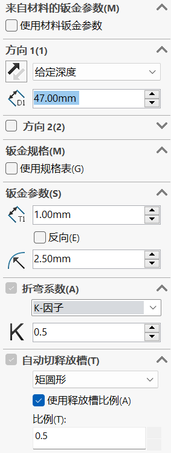

---

## 边线法兰

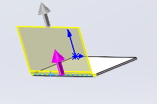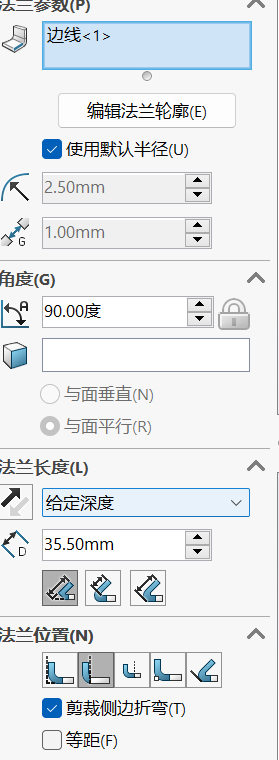

可以点击编辑边线法兰轮廓来编辑法兰的具体形状

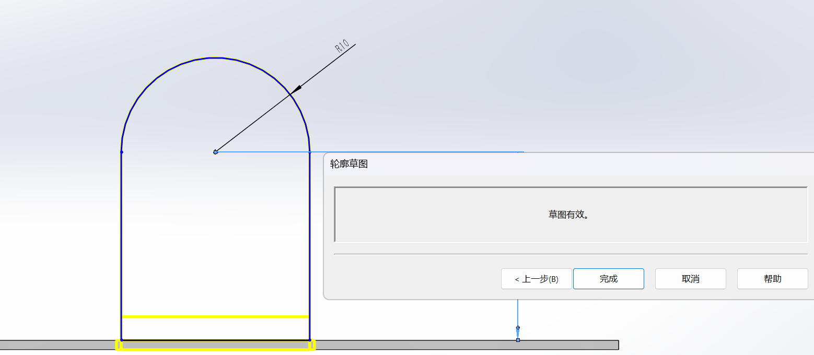

编辑完之后可以直接点击完成即可

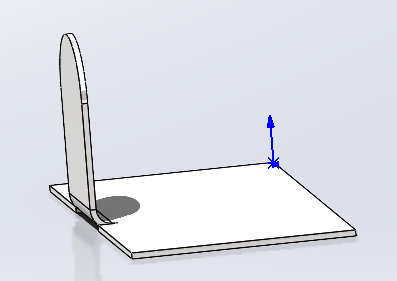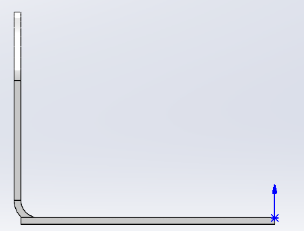

> 使用时注意圆角对齐方式

---

## 斜接法兰

此功能与特征中的扫描有些许相似

1. 首先需要画一个草图
2. 点击斜接法兰
3. 点击需要斜接的边线

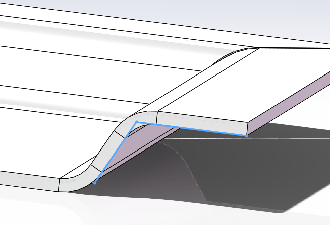

> 不能画过于复杂的草图以免引起生产问题

---

## 褶边

`主要是为了防止割手`

这个命令不需要绘制草图直接点击需要褶边的边线即可

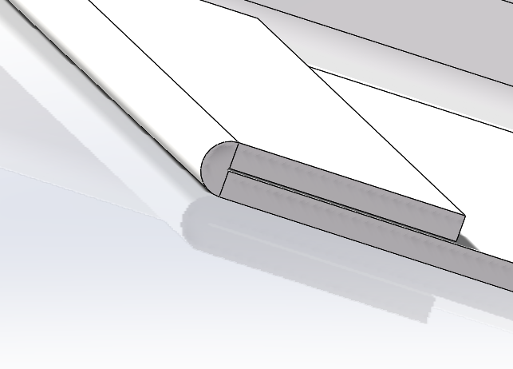

有些时候会出现无法预览的情况可以尝试加大半径

当然还有其它的一些形式也是可以尝试的

它也是可以编辑草图的

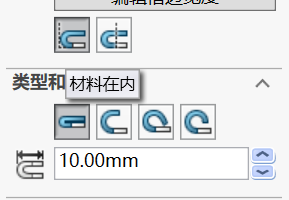

> 注意：材料对其方式

---

## 转折

1. 绘制折弯线(草图)
2. 点击转折命令
3. 选择固定面

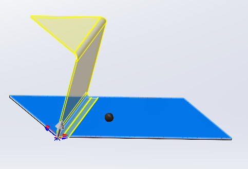

上视图：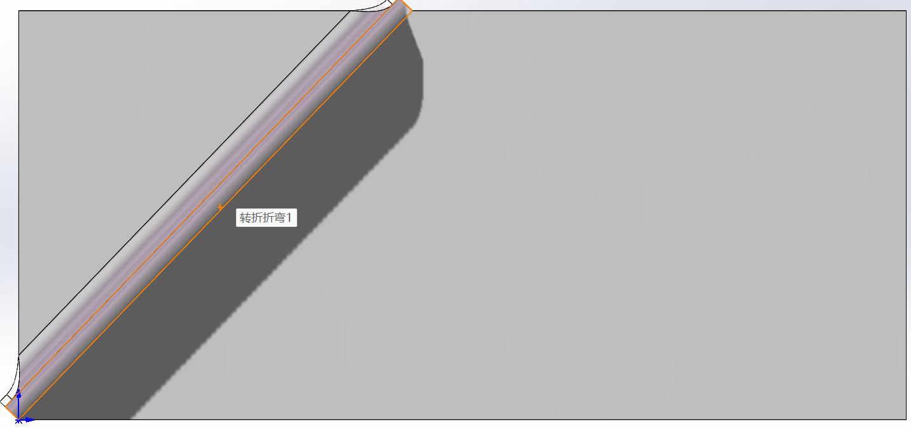

4. 调整需要的高度和角度

> 注意：它是将除去固定面的地方提起来，其他的面的大小基本不变

## 绘制的折弯

1. 点击绘制的折弯
2. 点击需要绘制的平面
3. 绘制折弯线（折弯线可以不止一条）
4. 选择固定面
5. 选择折弯度数和折弯位置

   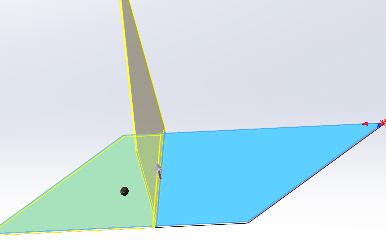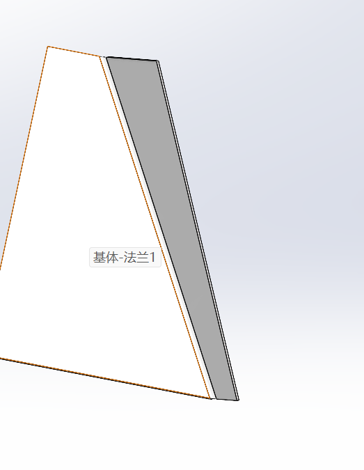

> 它是将除固定面外的面折起来，不能使用曲线

## 钣金冲压

1. 打开设计库

   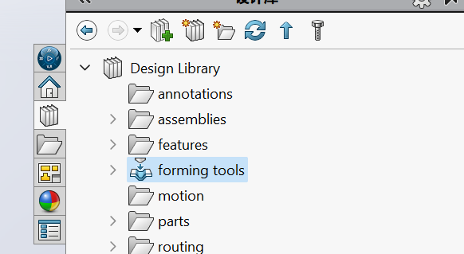
2. 新建设计库零件

   1. 点击Design Library
   2. 点击Forming Tools
   3. 右击打开文件位置
   4. 在该文件夹下新建文件夹

   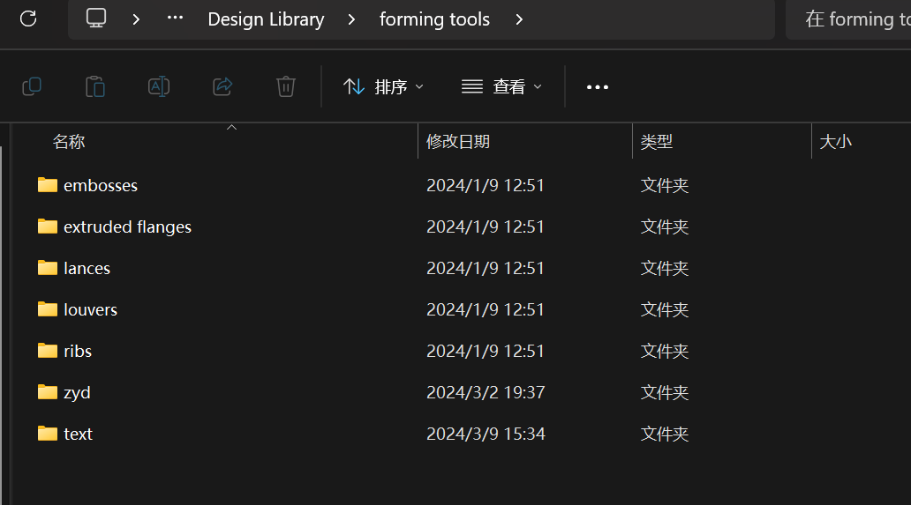

   5. 回到solidworks的设计库中

   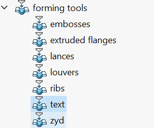
3. 使用成形工具

   1. 新建零件

   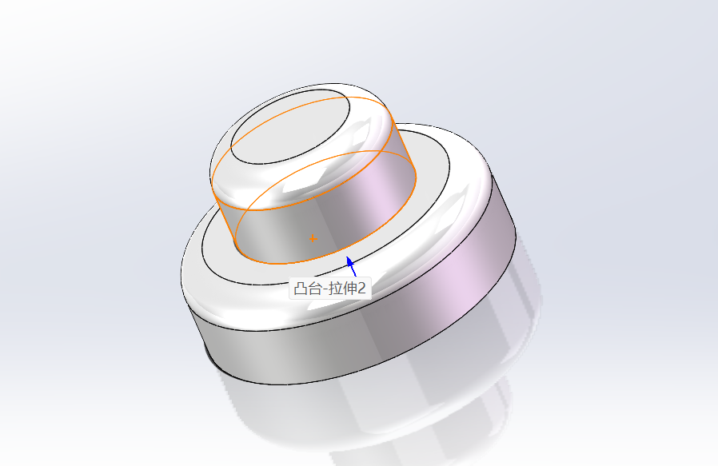

   2. 使用成形工具

   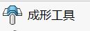

   3.停止面选底面，移除面选顶面（移除面可选可不选）
   4.将零件保存至text文件夹中
4. 到需要冲压的钣金中进行冲压

   1. 新建零件
   2. 在某一基准面画出一条直线
   3. 点击基体法兰/薄片
   4. 在设计库中拉出刚才创建好的零件

   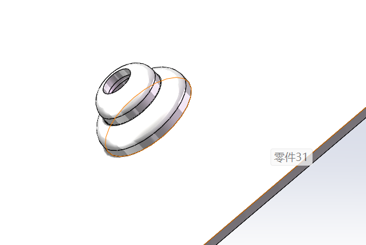

> 创建好的冲压外形**无法**在被冲压零件中被修改

---
